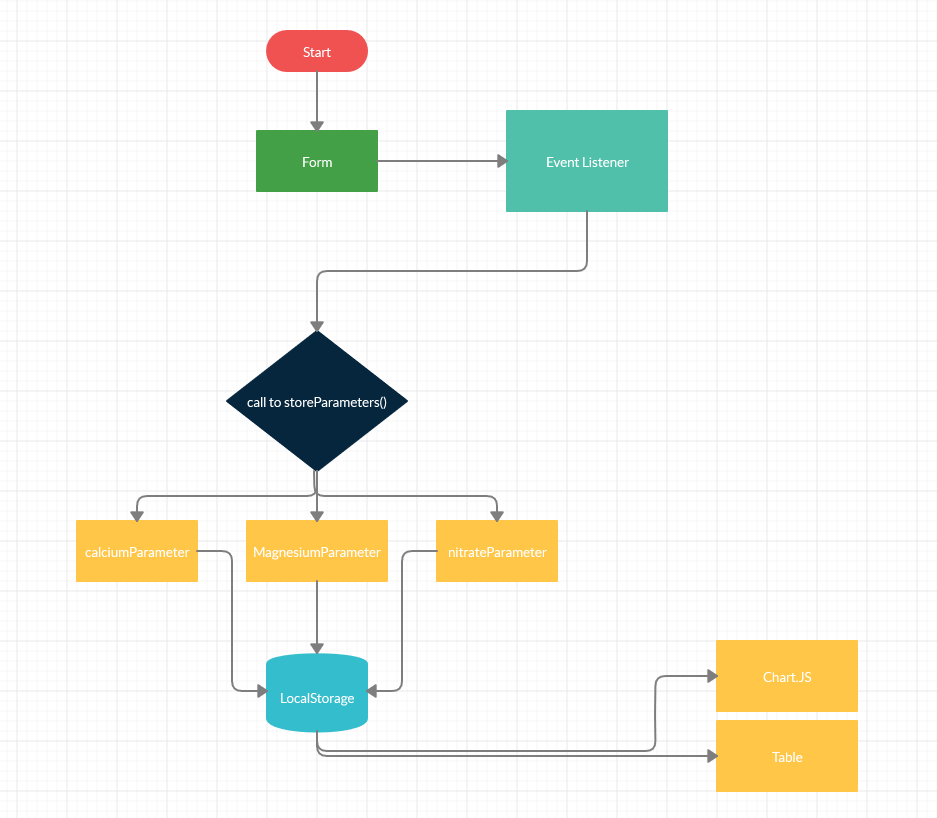

# fishy_tracker

## Team Shaggy

* Blake Romero
* Amelia Waggoner
* Rene Montoya
* David Dicken

### This is an app that will allow a user to track water parameters in their reef aquarium. The app will then display a visual chart of the data, and on a separate page produce a table of all the data submitted.

## Wireframe

## User Stories:

* I am a reef tank owner, I want a graph of my water parameter, so that I can visualy see my water parameter swings.
* I am a new fish tank owner, I want something to track my water parameters so that I can show my local fish store the info to find out why all my fish died.
* I am a reef tank element supplier, I want something my customers can use to track their water parameters, so that they can see how good my product is.
* I am a local fish store employee, I want something to recomend to people to track their water parameters, so that they can stop bringing dead fish back to me.
* I am a reef tank owner, I want a table of all the parameter test I've ever done, so that I can see what my parameters where when my tank was at it's best.

## Domain Model

## Entity Relationship Diagram

